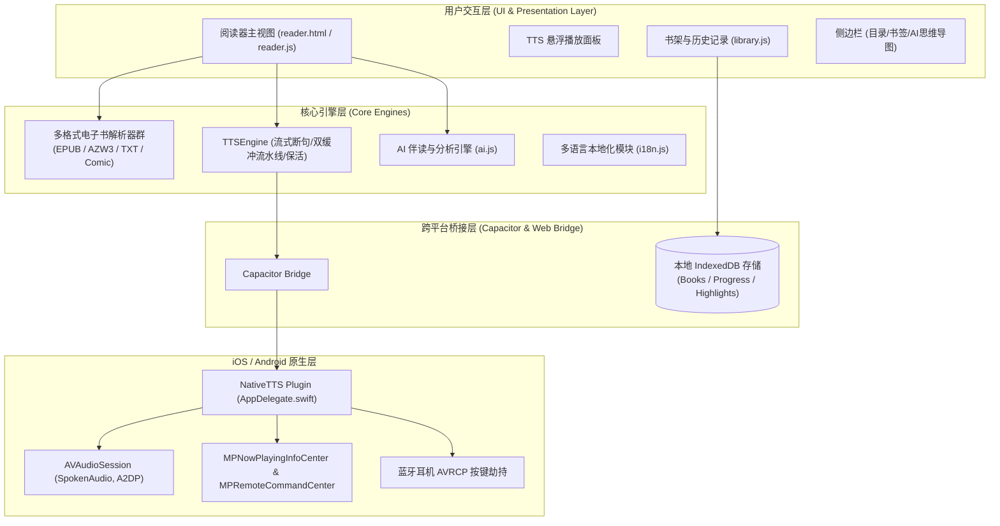
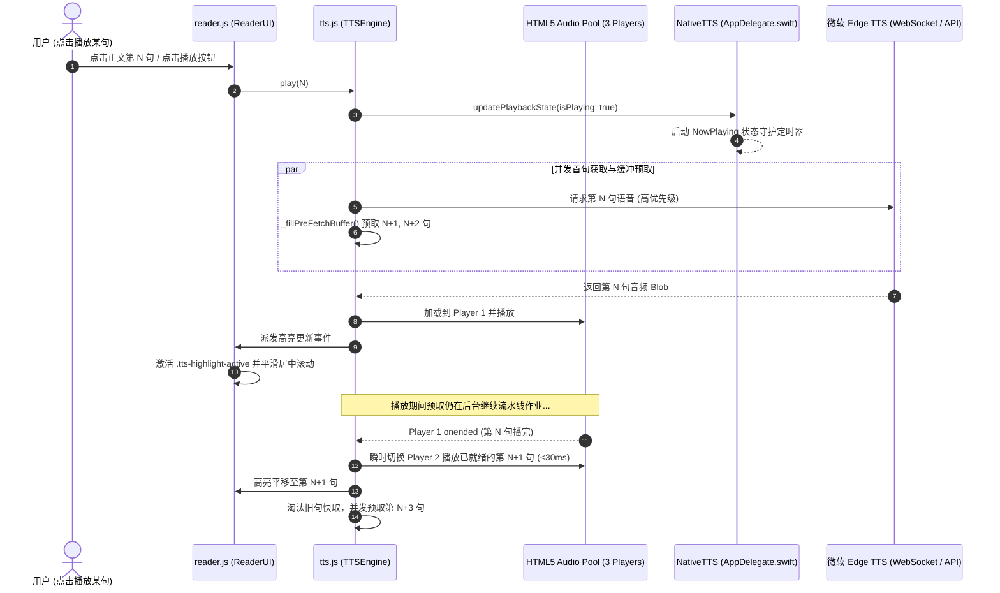
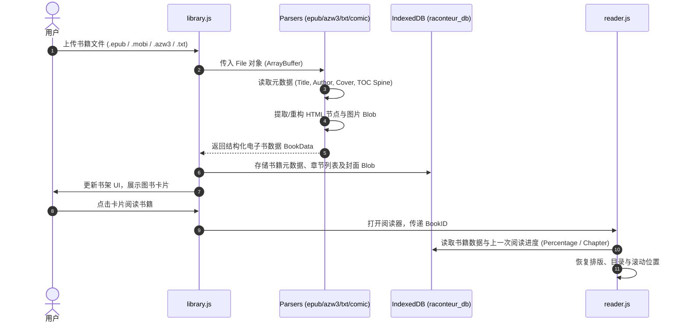

# Raconteur Reader (Edge-Reader) 全系统架构设计与核心技术方案白皮书

> **文档版本**: 1.0.0 (基线版本: v3.4.31)  
> **面向对象**: 架构师、开发者以及后续负责代码分析、维护、重构的 LLM（大语言模型）代理。  
> **代码仓库**: [fancyburn/edge-reader](https://github.com/fancyburn/edge-reader)

---

## 目录
1. [系统总体架构与跨平台形态](#1-系统总体架构与跨平台形态)
2. [核心功能清单与技术实现要点](#2-核心功能清单与技术实现要点)
3. [核心特异性解决方案精萃（深度技术总结）](#3-核心特异性解决方案精萃深度技术总结)
   - 3.1 [Edge TTS 连续流式分块合成与双向时间戳同步](#31-edge-tts-连续流式分块合成与双向时间戳同步)
   - 3.2 [iOS 锁屏 20 秒休眠唤醒与 WebKit 进程微音量保活](#32-ios-锁屏-20-秒休眠唤醒与-webkit-进程微音量保活)
   - 3.3 [蓝牙耳机按键 (AVRCP) 与锁屏 NowPlaying 守护机制](#33-蓝牙耳机按键-avrcp-与锁屏-nowplaying-守护机制)
   - 3.4 [离线单文件全静态编译管道与沙箱化隔离](#34-离线单文件全静态编译管道与沙箱化隔离)
4. [模块流程图与调用关系](#4-模块流程图与调用关系)
   - 4.1 [系统分层架构全景图](#41-系统分层架构全景图)
   - 4.2 [TTS 流水线与滑动窗口预取时序图](#42-tts-流水线与滑动窗口预取时序图)
   - 4.3 [iOS 锁屏/耳机远程控制双向 IPC 交互图](#43-ios-锁屏耳机远程控制双向-ipc-交互图)
   - 4.4 [电子书导入解析与存储流水线](#44-电子书导入解析与存储流水线)
5. [关键源码索引与模块职责速查](#5-关键源码索引与模块职责速查)
6. [后续维护与二次开发红线（Do's and Don'ts）](#6-后续维护与二次开发红线dos-and-donts)

---

## 1. 系统总体架构与跨平台形态

Raconteur Reader 是一款采用 **“一套现代 Web 核心，四端无缝交付”** 理念构建的高性能电子书阅读与 AI 伴读引擎。

```
                    ┌──────────────────────────────────────────────┐
                    │      Raconteur Reader Core (Vanilla JS)      │
                    │  - Parser: EPUB, AZW3, MOBI, TXT, CBZ/CBR   │
                    │  - Engine: TTSEngine (Edge Online + Native)  │
                    │  - AI: Multi-Provider LLM & MindMap Parser   │
                    │  - Storage: IndexedDB Book & Reading Storage │
                    └──────────────────────┬───────────────────────┘
                                           │
         ┌───────────────────┬─────────────┴───────┬───────────────────┐
         ▼                   ▼                     ▼                   ▼
   [ Web / PWA ]     [ Chrome Extension ]    [ iOS Native ]    [ Android Native ]
  Single-page PWA      Manifest V3 Side       Capacitor 6 +      Capacitor 6 +
   ServiceWorker        Panel & Popup         Swift Plugins      Java Services
```

### 交付形态与技术栈
1. **Web / PWA**: 基于单文件离线渲染 (`reader_offline.html` / `index.html`)，配合 Service Worker 实现 100% 离线可用。
2. **Chrome Extension (MV3)**: 利用 `manifest.json` 将阅读器封装为侧边栏 (Side Panel) 与独立标签页应用。
3. **iOS App (Capacitor 6 + Swift)**:
   - 宿主容器：Capacitor 桥接 WKWebView。
   - 原生插件：`NativeTTS` (`ios/App/App/AppDelegate.swift`)，管理原生音频会话、锁屏信息（Now Playing）、蓝牙耳机 AVRCP 事件、后台下载与电话/Siri 中断。
4. **Android App (Capacitor 6 + Java)**:
   - 原生前台保活服务 (`ForegroundService`)，维持后台音频连续性与状态栏通知栏交互。

---

## 2. 核心功能清单与技术实现要点

### 2.1 格式解析与排版渲染 (`reader/parsers/`)
- **EPUB 解析器 (`epub-parser.js`)**:
  - 基于 `JSZip` 流式解压。自动兼容 EPUB 2 (`toc.ncx`) 与 EPUB 3 (`nav.xhtml`) 目录结构。
  - 智能资源重映射：拦截 HTML 内的所有 ``、`<link>`、`<image>`，将其转换为由 Blob URL 托管的内联资源，防范 CORS 限制。
  - 支持固定版式 (Fixed-layout) 与回流排版 (Reflowable)。
- **AZW3 / MOBI 解析器 (`azw3-parser.js`)**:
  - 实现纯前端二进制 PalmDOC 解密、LZ77 变种解压以及 Huff/CDIC 字典树解压算法。
  - 从 Kindle 专有 Header 中提取元数据、封面图像与内部 HTML 文本流。
- **TXT 智能解析器 (`text-parser.js`)**:
  - 正则表达式动态智能识别卷、章、回、节（例如 `第[0-9一二三四五六七八九十百千]+[章回卷节]`）。
  - 自动分章建立虚拟目录，支持大文件切片流式加载。
- **漫画模式 (`comic-parser.js`)**:
  - 针对 CBZ / ZIP / 图片型 EPUB 提供画廊翻页模式与全宽自适应模式。

### 2.2 阅读交互与样式排版 (`reader/reader.js`, `reader/reader.css`)
- **多主题适配**: 默认白、羊皮纸黄 (Sepia)、暗黑 (Dark)、OLED 纯黑 (OLED Black)。
- **双模排版**: 支持横向分栏分页（多栏滑动翻页）与纵向平滑滚动模式。
- **排版微调**: 字号、行高、段落间距、首行缩进、边缘边距均可在设置面板实时无级调节。
- **高亮、书签与笔记**: 点击或划选任意段落建立高亮，自动计算基于 DOM 骨架的 XPath/偏移量并保存于 IndexedDB。

### 2.3 AI 智能伴读 (`reader/ai.js`)
- **多端模型接入**: 支持 OpenAI、Anthropic Claude、Google Gemini、Ollama 本地大模型。
- **阅读理解与提取**:
  - 当前章节全文智能摘要与核心要点总结。
  - 角色关系图谱生成。
  - 思维导图自动生成：支持渲染为交互式思维导图 (`mind-elixir.js`) 或流程图 (`mermaid.min.js`)。

### 2.4 本地图书馆与数据管理 (`reader/library.js`)
- **存储方案**: 纯前端 IndexedDB，书籍以 Blob 格式保存在客户端设备，无任何隐私泄露风险。
- **书架功能**: 分类过滤、全局搜索、阅读进度百分比追踪、历史阅读时长统计。
- **跨平台导出**: 支持图书文件导出、阅读进度与高亮笔记 JSON 备份及恢复。

---

## 3. 核心特异性解决方案精萃（深度技术总结）

> ⚠️ **关键技术提醒（给后续 LLM 的重要指示）**：  
> 以下 4 大解决方案是历经多轮真实设备测试、系统级逆向与防回归调试沉淀下来的核心资产。在对相关代码进行修改时，**必须严格遵守其中的约束，切勿以“简化代码”为由随意回退或改动底层逻辑**。

---

### 3.1 Edge TTS 连续流式分块合成与双向时间戳同步
- **源码对应**: [`reader/tts.js`](file:///Users/burnfan/Antigravity/Edge-Reader/reader/tts.js)

#### 痛点挑战
微软 Edge TTS 官方 WebSocket 协议仅用于短文本合成，不提供整本有声书的流式断句播放。若整章一次性合成，首字延迟过高（5~10 秒）；若单句独立合成，句子间存在明显的卡顿（Gap）与机械感，且正文高亮无法与声音精确同步。

#### 核心设计架构
1. **两阶段语义分词切分 (`_extractSentences()`)**:
   - 提取章节 DOM 时，保留原始 DOM 节点的引用。
   - 采用正则根据中英文终止标点（`。！？；…\n`）将正文切分成句子级原子，同时保留前置标点、后引号（`”’`）的完整语义绑定。
   - 在正文 DOM 中，动态用 `<span class="tts-sentence" data-sentence-index="X">` 包裹每一句话，实现视觉 DOM 与内存分句的一一映射。
2. **三播放器交替轮转双缓冲流水线 (`this.players`)**:
   - 实例化 3 个 HTML5 `Audio` 元素（Pool）。
   - **滑动窗口预取算法 (`_fillPreFetchBuffer()`)**: 播放当前第 $N$ 句时，后台并发预取第 $N+1$ 至 $N+5$ 句的音频。
   - 当第 $N$ 句接近结束（或触发 `ended`）时，第 $N+1$ 句已就绪于内存 Blob URL，立即无缝启动播放器，将换句间隔压制在 **< 30 毫秒** 内，人耳完全听不出断点。
   - **跨章节预加载 (`_prefetchNextChapter()`)**: 当播放到当前章节剩余最后 5 句时，后台自动异步解析下一章节的 HTML 并追加到分句队尾，实现真正的“全书无缝连续听书”。
3. **视口平滑滚动与高亮跟随**:
   - 每句播放启动瞬间，高亮类 `.tts-highlight-active` 立即切换，并调用 `element.scrollIntoView({ behavior: 'smooth', block: 'center' })`，保证阅读视觉焦点始终处于屏幕正中。

---

### 3.2 iOS 锁屏 20 秒休眠唤醒与 WebKit 进程微音量保活
- **源码对应**: [`reader/tts.js`](file:///Users/burnfan/Antigravity/Edge-Reader/reader/tts.js) (`_startSilenceKeepAlive`), [`ios/App/App/AppDelegate.swift`](file:///Users/burnfan/Antigravity/Edge-Reader/ios/App/App/AppDelegate.swift)

#### 痛点挑战
在真实 iPhone 设备上，用户在锁屏状态下按下暂停（无论是点击锁屏界面的暂停键，还是轻捏 AirPods 耳机柄）。超过 20~30 秒后，iOS 系统的电源管理策略会强制挂起无声的 `com.apple.WebKit.WebContent` 网页渲染子进程。此时若用户再次点击播放，虽然原生 iOS 可以收到事件并向 WebKit 执行 `evaluateJavaScript("window.tts.resume()")`，但该调用会被完全丢弃/冻结，导致无法继续播放。

#### 失败方案复盘（前车之鉴）
1. **曾尝试在原生端用 `AVAudioPlayer` 循环播放静音**：
   - 结果：原生播放只能保住主进程 `com.edgereader.app`，**无法阻止** WebKit 独立沙箱子进程被挂起！
   - 更严重的是：由于必须支持蓝牙耳机控制，`AVAudioSession` 不能使用 `.mixWithOthers`。原生 `AVAudioPlayer` 占用了声卡输出，导致后续 WebKit 的真实发音被 CoreAudio 拒绝路由。

#### 终极解决方案：WebKit 进程内部微音量保活
1. **WebKit 内部静音音轨激活 (`_startSilenceKeepAlive()`)**:
   - 在 `tts.pause()` 被调用时，立即在 WebKit 页面内启动一个 200 字节 Base64 编码的 MP3 循环音频 (`this.silenceAudio`)。
   - 音量设置为 `0.001`（低于人耳听觉阈值，绝对无声）。
   - **原理**: WebKit 底层的 `ProcessThrottler` 会检测到本网页有活跃的 HTMLMediaElement 正在输出 PCM 数据到 CoreAudio，从而向 iOS 系统申请并持有 `ProcessAssertionType::MediaPlayback` 强保活断言，**彻底阻止 iOS 挂起 WebKit 进程**。
2. **恢复播放时立即让位 (`_stopSilenceKeepAlive()`)**:
   - 当用户恢复播放且真实语料发声的一瞬间（`currentAudio.play().then(...)` 或 `_playActiveSentence()`），立即执行 `_stopSilenceKeepAlive()` 暂停微音量音轨，避免任何双音轨竞争。
3. **防耗电 30 分钟看门狗 (`this._silencePauseTimeout`)**:
   - 暂停时启动 30 分钟定时器。若用户暂停后长达 30 分钟未做任何操作，自动调用 `tts.stop()` 彻底注销保活音轨并释放音频会话，允许手机进入深度休眠。

---

### 3.3 蓝牙耳机按键 (AVRCP) 与锁屏 NowPlaying 守护机制
- **源码对应**: [`ios/App/App/AppDelegate.swift`](file:///Users/burnfan/Antigravity/Edge-Reader/ios/App/App/AppDelegate.swift)

#### 关键约束与设计原则
1. **音频会话选项禁忌**:
   - 必须配置为：
     ```swift
     try session.setCategory(.playback, mode: .spokenAudio, options: [.allowAirPlay, .allowBluetoothA2DP])
     ```
   - 🚨 **绝对严禁添加 `.mixWithOthers`**！一旦添加该选项，iOS 系统会立即认定该应用不是排他性媒体中心，将直接剥夺其对 `MPRemoteCommandCenter` 和蓝牙耳机 AVRCP（单按暂停/播放、双击下一句、三击上一句）事件的监听权。
2. **NowPlaying 状态守护者 (`startNowPlayingGuardian`)**:
   - **痛点**: 当 WebKit 内部在两句话之间切换 `<audio>` 播放器时，旧音频销毁的一瞬间会向 iOS 系统触发一次隐式的 WebKit 媒体暂停通知，这可能瞬间把系统的锁屏进度条和播放图标拉回“暂停”状态。
   - **解决**: 原生端内置一个高频轻量定时器（守护者）。在 `isCurrentlyPlaying = true` 期间，若检测到锁屏播放状态被意外篡改，立即强制重写回 `.playing` 与 `playbackRate = 1.0`，锁屏播放图标始终稳定显示为暂停（⏸），杜绝闪烁。
3. **双向防回环与防抖标记 (`_resumeFromNative` / `_pauseFromNative`)**:
   - 当蓝牙耳机或锁屏触发原生处理函数（`handleRemotePlay` / `handleRemotePause`）时，原生已经先行更新了 `MPNowPlayingInfoCenter`。
   - 在原生向 WKWebView 发送 `evaluateJavaScript` 时，打上标志位：
     ```javascript
     if (window.tts) {
       window.tts._resumeFromNative = true;
       window.tts.resume();
       window.tts._resumeFromNative = false;
     }
     ```
   - Web 端的 `resume()` 收到标志位后，跳过反向调用 `window.Capacitor.Plugins.NativeTTS.updatePlaybackState`，消除无意义的 IPC 通信风暴与状态竞态。

---

### 3.4 离线单文件全静态编译管道与沙箱化隔离
- **源码对应**: [`scratch/compile_offline.js`](file:///Users/burnfan/Antigravity/Edge-Reader/scratch/compile_offline.js), [`scratch/build_dist.js`](file:///Users/burnfan/Antigravity/Edge-Reader/scratch/build_dist.js)

#### 核心设计
1. **解构 ES 模块为自包含执行闭包**:
   - `compile_offline.js` 按照依赖树顺序读取 `reader/i18n.js` -> `reader/library.js` -> 各 Parser -> `reader/tts.js` -> `reader/ai.js` -> `reader/reader.js`。
   - 自动剥离 `import` 和 `export` 关键字，将外部静态资源（语言包 `messages.json`、JSZip、Mind-Elixir 等）序列化为内联常量，直接注入到单文件 `index.html` 与 `reader_offline.html` 中。
2. **零 CDN 外部依赖**:
   - 所有字体、图标、第三方渲染库全部采用内联 Base64 或本地文件，离线断网环境下 100% 功能完好。
3. **构建同步流水线**:
   - 开发者运行 `npm run build:ios` 时，自动执行 `node scratch/build_dist.js` 将根目录产物编译到 `www/`，再触发 `npx cap sync ios` 将资源同步到 `ios/App/App/public/`，保证 WebKit 运行的永远是最新的打包代码。

---

## 4. 模块流程图与调用关系

### 4.1 系统分层架构全景图



---

### 4.2 TTS 流水线与滑动窗口预取时序图



---

### 4.3 iOS 锁屏/耳机远程控制双向 IPC 交互图

```mermaid
sequenceDiagram
    autonumber
    actor Listener as 听书用户
    participant Earphone as 蓝牙耳机 / 锁屏控制
    participant Native as AppDelegate (NativeTTS)
    participant WebKit as WKWebView (tts.js)

    Note over Listener,WebKit: 场景 A：用户在锁屏状态下轻捏耳机暂停，等待 25 秒
    Listener->>Earphone: 按压耳机柄 (Pause)
    Earphone->>Native: 发送 AVRCP MPRemoteCommand.pause
    Native->>Native: MPNowPlayingInfo.playbackState = .paused
    Native->>Native: 开启 30min 兜底休眠定时器
    Native->>WebKit: eval: window.tts._pauseFromNative=true; window.tts.pause();
    WebKit->>WebKit: currentAudio.pause()
    WebKit->>WebKit: _startSilenceKeepAlive() (启动微音量 0.001 循环保活音轨)
    
    Note over WebKit: WebKit 持有 MediaPlayback 强断言<br/>经历 25 秒长等待，WebKit 进程不被冻结！

    Note over Listener,WebKit: 场景 B：25 秒后，用户再次按压耳机恢复播放
    Listener->>Earphone: 按压耳机柄 (Play)
    Earphone->>Native: 发送 AVRCP MPRemoteCommand.play
    Native->>Native: MPNowPlayingInfo.playbackState = .playing
    Native->>WebKit: eval: window.tts._resumeFromNative=true; window.tts.resume();
    WebKit->>WebKit: currentAudio.play() (在常驻进程内立即恢复发声)
    WebKit->>WebKit: _stopSilenceKeepAlive() (立即停用微音量保活)
    Native-->>Native: 启动 NowPlaying 状态守护者，锁屏稳定显示播放中
```

---

### 4.4 电子书导入解析与存储流水线



---

## 5. 关键源码索引与模块职责速查

| 文件路径 | 模块名称 | 核心职责与关键方法 |
| :--- | :--- | :--- |
| [`reader/tts.js`](file:///Users/burnfan/Antigravity/Edge-Reader/reader/tts.js) | **语音朗读核心** | `_extractSentences()` (标点断句), `_fillPreFetchBuffer()` (滑动窗口预取), `_startSilenceKeepAlive()` (WebKit 内部微音量保活), `_stopSilenceKeepAlive()`, `play()`, `pause()`, `resume()`, `stop()` |
| [`ios/App/App/AppDelegate.swift`](file:///Users/burnfan/Antigravity/Edge-Reader/ios/App/App/AppDelegate.swift) | **iOS 原生桥接** | `NativeTTS` 类：`activateAudioSession()` (声卡模式), `updateNowPlaying()` (锁屏元数据), `startNowPlayingGuardian()` (防状态跳变守护), `handleRemotePlay/Pause/Toggle` (蓝牙耳机与锁屏事件) |
| [`reader/reader.js`](file:///Users/burnfan/Antigravity/Edge-Reader/reader/reader.js) | **阅读器交互中枢** | 分页/滚动排版控制、字体/主题响应、目录侧边栏导航、进度持久化计算、高亮划线与书签管理 |
| [`reader/library.js`](file:///Users/burnfan/Antigravity/Edge-Reader/reader/library.js) | **书架与数据仓库** | IndexedDB 增删改查、书架视图呈现、书籍导入导出、阅读时长与统计分析面板 |
| [`reader/parsers/epub-parser.js`](file:///Users/burnfan/Antigravity/Edge-Reader/reader/parsers/epub-parser.js) | **EPUB 规范解析** | 基于 JSZip 解压，处理 `container.xml`、`content.opf`、`toc.ncx`、`nav.xhtml`，资源重写为 Blob URL |
| [`reader/parsers/azw3-parser.js`](file:///Users/burnfan/Antigravity/Edge-Reader/reader/parsers/azw3-parser.js) | **Kindle 解析引擎** | PalmDOC / HuffCDIC 二进制解密、解压算法与 MOBI 章节解析 |
| [`reader/parsers/text-parser.js`](file:///Users/burnfan/Antigravity/Edge-Reader/reader/parsers/text-parser.js) | **纯文本智能分卷** | 正则表达式智能分章、字符编码探测、虚拟分页分块 |
| [`reader/ai.js`](file:///Users/burnfan/Antigravity/Edge-Reader/reader/ai.js) | **大模型智能伴读** | 多 LLM API 请求封装、章节摘要提示词工程、思维导图与关系图谱数据解析 |
| [`scratch/compile_offline.js`](file:///Users/burnfan/Antigravity/Edge-Reader/scratch/compile_offline.js) | **离线单文件编译器** | 静态打包管道：将各独立模块和语言包融合成单文件 `index.html` 与 `reader_offline.html` |
| [`scratch/bump_version.js`](file:///Users/burnfan/Antigravity/Edge-Reader/scratch/bump_version.js) | **版本协同更新脚本** | 一键同步 `package.json`、`manifest.json`、`project.pbxproj` (`MARKETING_VERSION`) |

---

## 6. 后续维护与二次开发红线（Do's and Don'ts）

为防止后续开发者或 LLM 在维护或增加新功能时引发隐蔽的系统级回归，请务必牢记以下红线准则：

### 🚨 绝对禁止的操作 (DON'Ts)
1. **切勿在 `AVAudioSession` 中开启 `.mixWithOthers`**:
   - 一旦开启，iOS 会剥夺蓝牙耳机 AVRCP 媒体按键监听权限，耳机的单按、双按切歌功能将全部失效。
2. **切勿在 iOS 原生端 (`AppDelegate.swift`) 使用 `AVAudioPlayer` 播放静音**:
   - 原生播放器会独占 CoreAudio 输出硬件，且无法阻止 WebKit 子进程冻结。WebKit 的保活**必须**由 WebKit 内部的微音量 HTMLMediaElement 完成。
3. **切勿直接修改 `www/` 目录下的代码**:
   - `www/` 是编译目标输出目录。所有代码修改必须在根目录的 `reader/`、`ios/` 中进行，并执行 `npm run build:ios` 重新编译同步。
4. **切勿在 `tts.resume()` 中直接取消看门狗超时**:
   - WebKit 在后台环境下调用 `audio.play()` 时，Promise 可能会立即 Resolve，但系统底层音频管线在冷唤醒时仍有数百毫秒的延迟。必须保留 500ms 看门狗检查 `currentTime` 是否真正前进，并在停滞时调用 `_playActiveSentence()` 自动兜底。

### ✅ 推荐遵循的最佳实践 (DOs)
1. **版本更新与发布流程**:
   - 每次修改核心功能后，运行以下标准流水线：
     ```bash
     node scratch/bump_version.js           # 自动更新各端版本号
     node scratch/build_dist.js             # 编译离线 HTML 并输出 www/
     npx cap sync ios                       # 同步原生工程资源
     ```
2. **端对端验证规范**:
   - 在向 Git 提交并推送前，推荐使用 `scratch/eval_helper.js` 在 Xcode 模拟器中执行真实的全链路自动化测试（朗读 -> 暂停 -> 等待 25 秒 -> 继续播放 -> 校验进度推进），确保功能无损。
