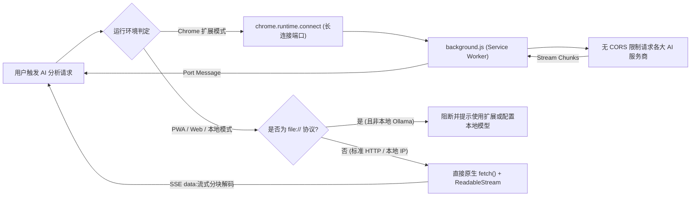
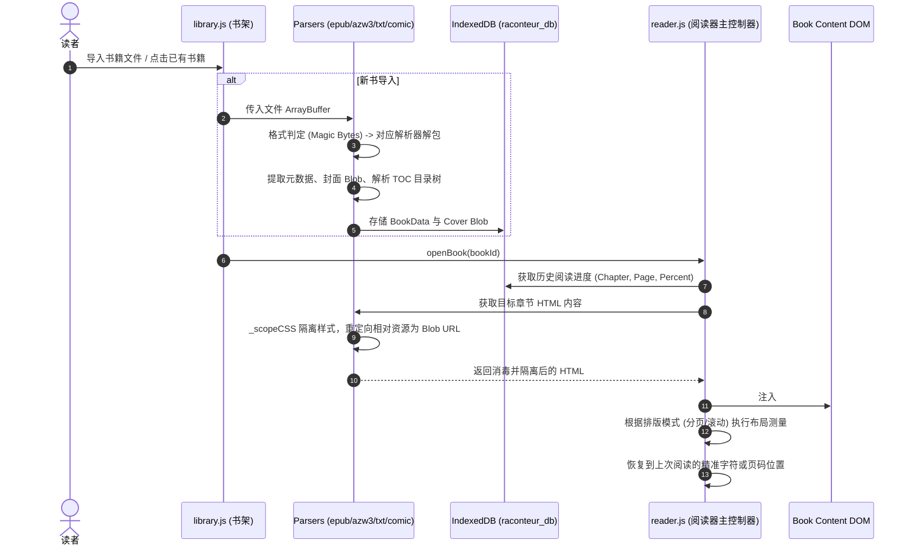
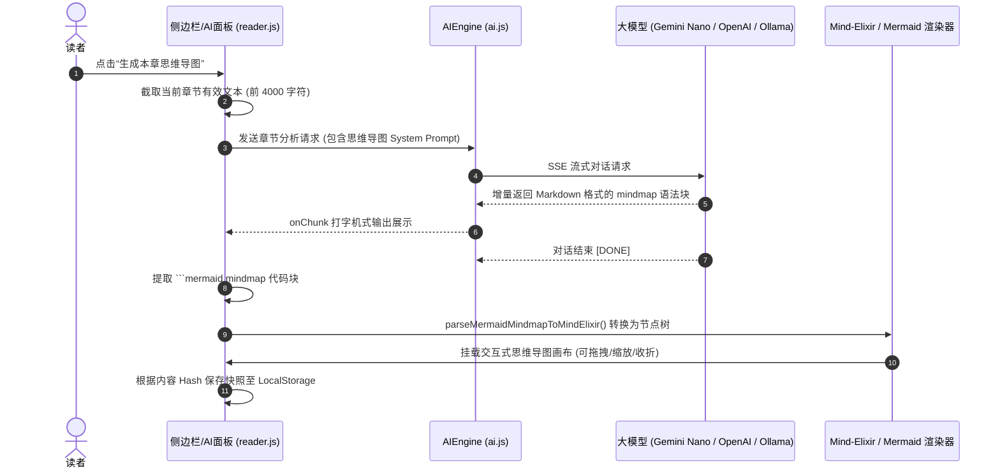

# Raconteur Reader (Edge-Reader) 全系统架构设计与核心技术方案白皮书 (v2.0)

> **文档版本**: 2.0.0 (基线版本: v3.4.31)  
> **面向对象**: 架构师、高级工程师、以及后续负责代码分析、性能调优、重构的 LLM（大语言模型）代理。  
> **代码仓库**: [fancyburn/edge-reader](https://github.com/fancyburn/edge-reader)

---

## 目录
1. [系统总体架构与跨平台交付形态](#1-系统总体架构与跨平台交付形态)
2. [电子书文件解析与底层解密/解压引擎](#2-电子书文件解析与底层解密解压引擎)
   - 2.1 [EPUB 流式重构与现代 CSS 隔离 (epub-parser.js)](#21-epub-流式重构与现代-css-隔离-epub-parserjs)
   - 2.2 [Kindle AZW3 / MOBI 二进制与 Huff/CDIC 字典树解压 (azw3-parser.js)](#22-kindle-azw3--mobi-二进制与-huffcdic-字典树解压-azw3-parserjs)
   - 2.3 [纯文本 TXT 编码自适应与智能分卷断章 (text-parser.js)](#23-纯文本-txt-编码自适应与智能分卷断章-text-parserjs)
   - 2.4 [漫画档案 CBZ/CBR 自然排序与流式翻页 (comic-parser.js)](#24-漫画档案-cbzcbr-自然排序与流式翻页-comic-parserjs)
3. [AI 智能阅读伴侣架构与使用逻辑 (ai.js)](#3-ai-智能阅读伴侣架构与使用逻辑-aijs)
   - 3.1 [多端服务商桥接体系 (Gemini Nano / OpenAI / Ollama)](#31-多端服务商桥接体系-gemini-nano--openai--ollama)
   - 3.2 [跨域 CORS 穿透与双模流式传输 (Extension Port vs SSE Fetch)](#32-跨域-cors-穿透与双模流式传输-extension-port-vs-sse-fetch)
   - 3.3 [提示词工程与阅读辅助管线 (摘要、生词、翻译)](#33-提示词工程与阅读辅助管线-摘要生词翻译)
   - 3.4 [思维导图 (Mind-Elixir) 与角色图谱 (Mermaid) 动态转换与缓存](#34-思维导图-mind-elixir-与角色图谱-mermaid-动态转换与缓存)
4. [内容排版渲染、主题与分页引擎深度剖析 (reader.js, reader.css)](#4-内容排版渲染主题与分页引擎深度剖析-readerjs-readercss)
   - 4.1 [双排版引擎：水平多栏分页 vs 垂直平滑滚动](#41-双排版引擎水平多栏分页-vs-垂直平滑滚动)
   - 4.2 [分页测量算法：克服 WebKit 多栏空列 Bug 与 3D 翻页动效](#42-分页测量算法克服-webkit-多栏空列-bug-与-3d-翻页动效)
   - 4.3 [主题与视觉系统 (Glassmorphism 毛玻璃与 OLED 纯黑)](#43-主题与视觉系统-glassmorphism-毛玻璃与-oled-纯黑)
   - 4.4 [字体系统、排版精细度与无障碍阅读 (OpenDyslexic)](#44-字体系统排版精细度与无障碍阅读-opendyslexic)
   - 4.5 [选区高亮、书签与跨重绘位置持久化 (XPath/Offset)](#45-选区高亮书签与跨重绘位置持久化-xpathoffset)
5. [TTS 流式语音朗读与 iOS 系统级保活方案（核心特异性技术）](#5-tts-流式语音朗读与-ios-系统级保活方案核心特异性技术)
   - 5.1 [Edge TTS 滑动窗口预取与无缝换句流水线](#51-edge-tts-滑动窗口预取与无缝换句流水线)
   - 5.2 [iOS 锁屏 20 秒休眠唤醒与 WebKit 内部微音量保活](#52-ios-锁屏-20-秒休眠唤醒与-webkit-内部微音量保活)
   - 5.3 [蓝牙耳机按键 (AVRCP) 与锁屏 NowPlaying 守护机制](#53-蓝牙耳机按键-avrcp-与锁屏-nowplaying-守护机制)
6. [全系统模块流程图与调用时序 (Mermaid)](#6-全系统模块流程图与调用时序-mermaid)
7. [关键源码索引与二次开发红线 (Do's and Don'ts)](#7-关键源码索引与二次开发红线-dos-and-donts)

---

## 1. 系统总体架构与跨平台交付形态

Raconteur Reader 采用 **“以标准原生 Web 构件为内核，构建无外部 CDN 依赖的单文件离线沙箱，外接跨平台 Native 运行时”** 的架构思想。

```
┌──────────────────────────────────────────────────────────────────────────────┐
│                    Raconteur Reader 全局核心模块 (Core)                      │
│ ┌───────────────────┐ ┌───────────────────┐ ┌──────────────────────────────┐ │
│ │  Book Parsers     │ │  TTS Engine       │ │  AI Companion                │ │
│ │  EPUB/AZW3/TXT/CBZ│ │  Edge/Native Synth│ │  Gemini/OpenAI/Mind-Elixir   │ │
│ └─────────┬─────────┘ └─────────┬─────────┘ └──────────────┬───────────────┘ │
│           │                     │                          │                 │
│ ┌─────────┴─────────────────────┴──────────────────────────┴───────────────┐ │
│ │  Reader & UI Central Engine (reader.js / reader.css)                     │ │
│ │  - 3D/CSS Multi-column Pagination Engine  - Glassmorphism & OLED Themes  │ │
│ │  - Typography & Custom Font Inlining      - DOM Range Highlights & Notes │ │
│ └───────────────────────────────────┬──────────────────────────────────────┘ │
│                                     │                                        │
│ ┌───────────────────────────────────┴──────────────────────────────────────┐ │
│ │  Storage & State Layer (library.js)                                      │ │
│ │  - IndexedDB (raconteur_db: books, reading_progress, highlights)         │ │
│ └───────────────────────────────────┬──────────────────────────────────────┘ │
└─────────────────────────────────────┼────────────────────────────────────────┘
                                      │
     ┌────────────────────────────────┼────────────────────────────────┐
     ▼                                ▼                                ▼
[ 网页版 / PWA ]            [ Chrome Extension ]             [ 移动客户端 (iOS / Android) ]
- 单文件内联 HTML            - Manifest V3 (Side Panel)       - Capacitor 6 原生桥接
- Service Worker 缓存        - background.js 端口跨域代理     - Swift NativeTTS 原生音频与锁屏控制
- 零外部 CDN，本地沙箱安全   - 标签页与侧边栏双模式           - Java ForegroundService 后台前台服务
```

---

## 2. 电子书文件解析与底层解密/解压引擎

阅读器内置 4 套自主实现的格式解析引擎，位于 `reader/parsers/`，所有解析完全在客户端浏览器沙箱内利用 JavaScript TypedArray 与 Web Streams 完成，不上传用户文件到任何服务器。

### 2.1 EPUB 流式重构与现代 CSS 隔离 (`epub-parser.js`)
- **解包与容器解析**：
  1. 通过 `JSZip.loadAsync(fileBlob)` 解压 EPUB 归档。
  2. 读取 `META-INF/container.xml` 查找 `rootfile` 的 `full-path`，定位核心元数据描述文件（通常为 `OEBPS/content.opf`）。
  3. 解析 OPF XML：
     - `<metadata>`：提取书名、作者、语言、发行方等。
     - `<manifest>`：构建 ID 到 `{ href, mediaType }` 的完整资源字典。
     - `<spine>`：提取线性阅读顺序列表（`idref` 序列）。
- **目录双模兼容与断链补全**：
  - **EPUB 2 / EPUB 3 目录自动降级**：优先探测 EPUB 3 的 Navigation Document（`properties="nav"` 或 `media-type="application/xhtml+xml"` 且包含 `<nav epub:type="toc">`）；若缺失则自动降级回退至 EPUB 2 的 NCX 文件（`toc.ncx`），解析 `<navMap>` 节点树。
  - **Spine 盲区自动补齐**：许多制作不规范的 EPUB 会将“致谢、附录、注释页”置于 Spine 中却未登记在 TOC 目录中。解析器通过计算 `spine` 与 `toc` 的差集，自动将遗漏章节以“Notes/Appendix”标题追加进章节列表，并继承前序章节标题，确保用户翻页不会跳过正文。
- **资源内联重定向与 CORS 突破**：
  - EPUB 内部 HTML 往往引用相对路径图片（如 ``）。
  - 解析器递归遍历所有 ``、`<svg><image>` 以及 `<link rel="stylesheet">`，利用 `_resolvePath(baseDir, href)` 计算相对路径的绝对归档路径，从 Zip 中提取二进制并生成内存 `URL.createObjectURL(blob)` 替换原始属性。
  - 拦截内部锚点链接：将 `<a href="chapter2.html#sec1">` 重写为 `data-epub-href="chapter2.html#sec1"` 并移除原生 `href`，彻底杜绝浏览器默认页面跳出。
- **现代 CSS 隔离技术 (`_scopeCSS`)**：
  - 书籍自带的 CSS 经常包含极具侵略性的规则（如 `html, body { margin: 0; font-size: 12px; }`），直接插入会污染整个阅读器 UI。
  - 解析器使用现代 **CSS `@scope (.book-content)`** 特性，在样式字符串外部包裹 `@scope` 规则块，同时用正则过滤掉针对 `html`、`body`、`:root` 的硬编码 `margin`/`padding`，既完美保留了排版书意，又防止外溢。
- **残缺标签碎片自动修补 (`_cleanMalformedTagFragments`)**：
  - 针对 Calibre、Sigil 等工具生成或切片遗留的残缺头部标签（如截断的 `body>`、`p>`、`class="sec">`），内置白名单自动闭合与前缀清理算法。

---

### 2.2 Kindle AZW3 / MOBI 二进制与 Huff/CDIC 字典树解压 (`azw3-parser.js`)
Kindle 专有的 `.mobi` 和 `.azw3` (KF8) 是基于 Palm Database (PDB) 的二进制复合文件。本模块实现了无外部依赖的原生二进制解析：

1. **PDB 文件头与 Record 偏移表解析**：
   - 校验 PDB Header（32 字节书名、Type 为 `BOOK`、Creator 为 `MOBI`）。
   - 读取 2 字节整型 `numRecords` 及后续每个 Record 的 4 字节全局偏移地址（`offset`），将文件切分为独立的二进位 Record 块。
2. **MOBI Header 与 EXTH 元数据提取**：
   - 解析 Record 0（MOBI 根控制块）：提取压缩标识（`1: 无压缩`, `2: PalmDOC`, `17480: HUFF/CDIC`）、MOBI Header 偏移量、首个文本 Record 索引、图片起始索引（`firstImageRecord`）及内容全长。
   - 读取 EXTH 扩展头：提取封面 Record 偏移（Tag 201）、ASIN（Tag 113）、标题（Tag 503）、作者（Tag 100）等。
3. **PalmDOC 解压算法 (`_decompressPalmDoc`)**：
   - 专为 PalmOS 设计的游程字节流解压：
     - 单字节 `0x00`：保留本身。
     - 单字节 `0x01` ~ `0x08`：直接原样输出后续 $N$ 个字节。
     - 字节 `0x09` ~ `0x7F`：直接输出该 ASCII 字符。
     - 高位为 `10xxxxxx`（`0x80` ~ `0xBF`）：双字节滑动窗口向前引用，提取之前解出的字符进行重复拼装。
     - 高位为 `11xxxxxx`（`0xC0` ~ `0xFF`）：与空格组成的二字符优化对。
4. **HUFF/CDIC 霍夫曼字典树解压缩 (`HuffCdicDecoder`)**：
   - 针对高压缩比 Kindle 书籍，解析紧跟在文本 Record 后的 `HUFF` 记录和若干 `CDIC` 字典记录。
   - 构建 32 级霍夫曼解码表（`mincode`、`maxcode`、`dict1`、`dict2`）。
   - 逐位读取比特流，匹配霍夫曼码字，递归从 CDIC 字典展开短语与词条，最终还原出未压缩的 HTML 字节流。
5. **跨 Record 截断合并与 KF8 流程表 (FDST)**：
   - 避免多字节 UTF-8 字符（如中文 3 字节）在 4096 字节 Record 边界被截断导致乱码，解析器先在 TypedArray 层面将所有 Record 无损拼接为单个连续的 `Uint8Array`，再统一交由 `TextDecoder('utf-8')` 解码。
   - 解析 AZW3 (KF8) 特有的 FDST 表，根据字节偏移量将整本书切分为语义明确的章节单元。

---

### 2.3 纯文本 TXT 编码自适应与智能分卷断章 (`text-parser.js`)
- **中文字符集无损探测 (`_decodeText`)**：
  1. **BOM 嗅探**：识别 UTF-8 BOM (`EF BB BF`)、UTF-16BE (`FE FF`)、UTF-16LE (`FF FE`)。
  2. **严格模式验证与环境回退**：先使用 `new TextDecoder('utf-8', { fatal: true })` 进行解码尝试。若抛出异常（表明存在非 UTF-8 字节序），则根据当前系统的语言环境：
     - 繁体环境（TW/HK/MO）自动回退到 `Big5`；
     - 其他中文环境自动回退到 `GB18030`（完全覆盖 GBK 与 GB2312）。
     - 最终若仍有未定义字节，使用容错模式兜底，杜绝白屏与抛错。
- **基于中文句式结构的智能分章算法 (`_parseTXT`)**：
  - 针对网络小说与古籍没有目录的问题，通过加权正则表达式动态匹配行首：
    ```regex
    ^\s*(第\s*[一二三四五六七八九十百千零0-9]+\s*[章回卷折篇幕節])|^\s*(Chapter\s*[0-9]+)
    ```
  - 自动识别“第X章”，将全文自动切分为轻量级章节列表，章节内段落自动包裹 `<p>` 标签并注入首行缩进排版，使 TXT 获得与出版级 EPUB 完全一致的翻页体验。

---

### 2.4 漫画档案 CBZ/CBR 自然排序与流式翻页 (`comic-parser.js`)
- **图片扩展名过滤与系统垃圾文件剥离**：
  - 遍历 ZIP 归档，提取 `.jpg`、`.jpeg`、`.png`、`.webp`、`.gif`、`.bmp`。
  - 自动过滤 macOS 压缩包附带的 `__MACOSX/` 影子目录及 `._` 开头的隐藏资源分支。
- **自然数字敏感排序 (`localeCompare` with `numeric: true`)**：
  - 漫画文件名往往是 `page_1.jpg`, `page_2.jpg`, ..., `page_10.jpg`。
  - 传统 ASCII 排序会导致 `page_10` 排在 `page_2` 前面。解析器采用 `localeCompare(undefined, { numeric: true, sensitivity: 'base' })`，保证漫画图片严格按照读者预期顺序呈现。
- **大图 Object URL 惰性加载**：
  - 不在解析时一次性解出所有大图（防止多图漫画导致几百兆内存占用闪退），仅将每一页包装为 `getImageUrl()` 异步惰性闭包，按需由读者翻页时创建并即时销毁。

---

## 3. AI 智能阅读伴侣架构与使用逻辑 (`ai.js`)

AI 伴读模块 (`AIEngine`) 采用统一的流式接口，支持“端侧离线小模型 + 云端大模型 + 私有化本地部署”三位一体架构。

### 3.1 多端服务商桥接体系
- **浏览器内原生 AI (Built-in Gemini Nano)**：
  - 基于 Chromium 最新的 `window.ai.languageModel`（或旧规范 `window.ai.assistant`）本地 Prompt API。
  - **优势**：0 延迟、完全离线、不消耗任何 API Token，特别适合离线环境下的选段释义与简短问答。
- **公有云标准 API (OpenAI / Claude / DeepSeek / Gemini)**：
  - 兼容标准 OpenAI Chat Completions 协议（`/v1/chat/completions`）。
  - 支持用户自定义 Endpoint、API Key 及 Model Name。
- **私有化本地大模型 (Ollama)**：
  - 针对在 Mac/PC 本地运行 Ollama 的极客用户，直接连接 `http://localhost:11434/api/chat`，实现完全自主可控的大模型伴读。

---

### 3.2 跨域 CORS 穿透与双模流式传输
在现代浏览器安全沙箱下，Web 页面直接访问外部 AI API 会面临严苛的跨域限制（CORS）。系统设计了双通道架构：



1. **Extension 模式**：页面与 Background SW 建立专用长连接通道 (`ai-stream`)。由于 Chrome 扩展在 `manifest.json` 中声明了 `host_permissions`，Background 具备系统级网络权限，完全绕过浏览器的同源策略。
2. **纯 Web / PWA 模式**：通过原生 `fetch()` 配合 `response.body.getReader()` 进行 UTF-8 流式增量解码，逐行解析 Server-Sent Events (`data: {...}`)，实现打字机般的流畅交互。

---

### 3.3 提示词工程与阅读辅助管线
系统预设了多套经深度微调的系统提示词（System Prompt），涵盖核心阅读场景：

1. **章节全文智能摘要 (`summarize`)**：
   - 提取当前章节核心文本（截取关键 4000 字符以内防止溢出 Context Window）。
   - Prompt 约束：“以输入文本的相同语言，输出 3 点核心提要与 1 句简短结语，保持客观精炼”。
2. **生词语境释义 (`explainWord`)**：
   - 提取用户划选的单个单词/短语，并截取该词前后各 250 字符作为**语境上下文（Context Window）**一并喂给大模型。
   - Prompt 约束：“结合所给上下文，解释该词在本文中的特定含义、感情色彩或典故来源，严禁脱离语境泛泛而谈”。
3. **沉浸式段落翻译 (`translate`)**：
   - 根据用户首选项将外语直接翻译为目标语言，强制要求“仅输出翻译结果本身，不包含任何开场白或解释”。

---

### 3.4 思维导图 (Mind-Elixir) 与角色图谱 (Mermaid) 动态转换与缓存
本应用最亮眼的 AI 功能是将书本内容一键视觉化为**交互式思维导图**与**人物关系拓扑图**：

```
                    ┌──────────────────────────────────────────────┐
                    │      AI 大模型输出 (Mermaid mindmap / graph) │
                    └──────────────────────┬───────────────────────┘
                                           │
                        正则预处理与 AST 语法解析
                                           │
              ┌────────────────────────────┴────────────────────────────┐
              ▼                                                         ▼
    [ Mind-Elixir 交互式思维导图 ]                             [ Mermaid 流程/关系拓扑 ]
    - 转换为 { id, topic, children } 节点树                   - 渲染为矢量 SVG 图形
    - 支持鼠标拖拽、平移、滚轮缩放                            - 自动计算节点间距与 Rank 布局
    - 支持节点动态收起/展开、文本编辑                         - 适合人物关系、剧情时间线
    - 根据内容 Hash 自动保存编辑状态至 LocalStorage           - 支持暗黑/明亮主题自适应
```

- **Mermaid 到 Mind-Elixir 语法转换器 (`parseMermaidMindmapToMindElixir`)**：
  - AI 输出结构化思维导图通常遵循 Mermaid 的 `mindmap` 缩进语法。
  - 阅读器内部解析器扫描每行的缩进层级（Indent Level），利用栈结构构建出标准的 Mind-Elixir JSON 树对象。
  - 若解析失败或环境缺失脚本，自动无缝降级为原生 `mermaid.render()` 矢量 SVG 呈现，杜绝白屏。
- **状态快照与局部持久化**：
  - 计算原始导图文本的哈希指纹（Hash Code），以此为 Key 监听 Mind-Elixir 的 `operation` 和 `expandNode` 事件，将用户的二次编辑实时同步保存到 `localStorage` 中。

---

## 4. 内容排版渲染、主题与分页引擎深度剖析 (`reader.js`, `reader.css`)

阅读器的渲染排版层承载着极高的视觉与交互要求，需在不同屏幕尺寸、横竖屏切换以及海量文字下保持 60 FPS 的流畅度。

### 4.1 双排版引擎：水平多栏分页 vs 垂直平滑滚动
系统提供两种完全不同的排版范式：

| 特性维度 | 水平多栏分页 (`layout-paginated`) | 垂直连续滚动 (`layout-scroll`) |
| :--- | :--- | :--- |
| **底层 CSS 原理** | `column-width: calc(100vw - Xpx)`、`height: 100vh`、`overflow: hidden` | 正常文档流、`overflow-y: auto`、`-webkit-overflow-scrolling: touch` |
| **翻页驱动机制** | 容器水平位移：`transform: translateX(-N * step)` | 视口纵向滚动：`window.scrollTo({ top, behavior })` |
| **阅读进度衡量** | 当前页索引 / 本章总页数 (`currentPageIndex / totalPages`) | 视口顶部最高可见段落的文字偏移百分比 |
| **适用场景** | 沉浸式听书、平板双栏仿纸质书阅读、墨水屏设备 | 网页长文快速通读、代码块较多的技术书籍、漫画模式 |

---

### 4.2 分页测量算法：克服 WebKit 多栏空列 Bug 与 3D 翻页动效

#### WebKit “幽灵空白列” Bug 攻坚
在 WebKit / Safari 的 CSS 多栏排版（Multi-column Layout）中，存在一个存在已久的底层 Bug：当章节末尾包含隐蔽的空白标签、不可见 `<style>` 或 margin 穿透时，`content.scrollWidth` 会错误计算出 1 到 2 个没有任何文字的“幽灵空白列”，导致翻页到最后全是白屏。

**阅读器的解决方案 (`getPaginatedPagesInfo`)**：
1. 计算前先临时重置 `content.style.transform = 'none'`，消除之前位移对位置测量的污染。
2. 不盲信 `scrollWidth`，而是遍历 `content.children` 中所有可见元素（排除 `<link>`, `<style>`, `<script>` 且 `width > 0 || height > 0` 的元素）。
3. 调用 `rect.right - contentRect.left` 精确算出**最右侧真实可见像素的绝对边界（`maxRight`）**。
4. 总页数计算公式：
   $$\text{step} = \text{containerWidth} + \text{columnGap}$$
   $$\text{totalPages} = \max\left(1, \left\lceil \frac{\text{actualWidth} - 1}{\text{step}} \right\rceil\right)$$
   此举彻底消除了最后一页空白翻不过去的顽疾！

#### 真实 3D 拟真翻页效果 (`runCustom3DFlip`)
- 在支持 CSS 3D 的设备上，启用真实纸质书翻页特效：
  - 创建动态叠加层，利用 `perspective: 1600px` 建立景深。
  - 将翻页卡片分为正面 (`flipping-front`) 与背面 (`flipping-back`)，通过 `backface-visibility: hidden` 和 `transform-origin: right center`（书脊线）进行 `rotateY(180deg)` 变换。
  - 辅以微妙的阴影渐变动画（`box-shadow` 与 `opacity` 衰减），呈现如真实翻动纸张的质感。

---

### 4.3 主题与视觉系统 (Glassmorphism 毛玻璃与 OLED 纯黑)
界面全面采用现代 **毛玻璃微交互（Glassmorphism）** 风格，顶部导航条与底部操作栏使用 `backdrop-filter: blur(20px)`，在滚动时优雅透出正文字迹。

系统定义了 6 套官方主题变量：
1. **Light（经典明亮）**：`#f7f9fa` 背景，配合深灰 `#2c3e50` 文本，对比度柔和。
2. **Sepia（羊皮纸复古）**：`#f4ecd8` 暖黄色底色，专为长时间阅读抗疲劳设计。
3. **Dark（精致暗黑）**：`#1a1a1e` 幽深背景，配合低饱和度高光，适合夜间阅读。
4. **OLED Black（纯黑无光）**：`#000000` 绝对纯黑，OLED 屏幕像素完全断电，极致省电。
5. **Mint（青草薄荷）**：`#f0f7f4` 浅绿舒缓色调。
6. **Sakura（落樱淡粉）**：`#fdf5f5` 柔粉浪漫主题。

所有主题均通过 CSS Custom Properties 集中管理（`--bg-color`, `--text-color`, `--surface-color`, `--glass-bg`, `--border-color`），切换主题时只需在 `document.body` 切换类名，全站样式在 0.3 秒内平滑淡入淡出（`transition`）。

---

### 4.4 字体系统、排版精细度与无障碍阅读 (OpenDyslexic)
- **多字体族预设**：
  - `--font-sans`：系统无衬线字体（Inter, -apple-system, Segoe UI）。
  - `--font-serif`：经典衬线字体（Lora, Georgia, 宋体）。
  - `--font-lxgw`：广受好评的**霞鹜文楷 (LXGW WenKai)**，带来温润典雅的楷体阅读体验。
  - `--font-noto-serif`：思源宋体。
  - `--font-fira`：代码与技术专著等宽字体。
  - `--font-dyslexic`：**OpenDyslexic 特殊字型**（针对阅读障碍症患者特别加厚字体重心，有效防止视觉漂移与字母混淆）。
- **零网络字体离线内联 (`inlined_google_fonts.css`)**：
  - 为确保离线版无需联网即可使用优质 Web 字体，打包管道内联了经过 WOFF2 压缩的核心字形子集。
- **全维度排版可调节性**：
  - 字号：12px ~ 48px 无级缩放。
  - 行距（`line-height`）：1.0 ~ 3.0。
  - 边距（`margin-width`）：分页模式与滚动模式各自独立记忆，防止切换模式破坏排版。
  - 段间距（`paragraph-spacing`）与对齐方式（左对齐 / 两端对齐并启用断字 `hyphens: auto`）。

---

### 4.5 选区高亮、书签与跨重绘位置持久化 (XPath/Offset)
用户划选文本后弹出的上下文菜单支持“划线高亮（4 种荧光色）、添加笔记、AI 解释、复制与朗读”：

1. **跨标签文本选区序列化**：
   - 用户的 Selection 可能会横跨多个 DOM 节点（如从 `<p>` 划到 `<span>`）。
   - 系统将选区规范化为相对于章节根节点的文本字符偏移量（`startOffset`, `endOffset`）与上下文特征字符串（Prefix, SelectedText, Suffix）。
2. **高亮重绘容错**：
   - 当书籍因调整字号或翻页重新加载章节时，系统利用文本匹配算法在全新 DOM 中重新寻找对应文本范围，再次注入 `<mark class="tts-highlight highlight-color-X">`，确保阅读笔记永不丢失。
3. **所有标记统一持久化存储于 IndexedDB**，并在侧边栏“笔记与高亮”抽屉中集中聚合展现，点击任意一条即可精准直达对应章节对应位置。

---

## 5. TTS 流式语音朗读与 iOS 系统级保活方案（核心特异性技术）

关于 Edge TTS 与 iOS 锁屏/耳机后台保活的深度实现方案，已在前序章节与 [`reader/tts.js`](file:///Users/burnfan/Antigravity/Edge-Reader/reader/tts.js)、[`ios/App/App/AppDelegate.swift`](file:///Users/burnfan/Antigravity/Edge-Reader/ios/App/App/AppDelegate.swift) 中进行了全量工程化落地：

### 5.1 Edge TTS 滑动窗口预取与无缝换句流水线
- 标点分句切分原子，动态包裹 `<span class="tts-sentence" data-sentence-index="X">`。
- 3 个 `Audio` 播放器实例交替轮转，当前句播放时并发预取后续 5 句，句间切换延迟压制在 **< 30ms** 内。
- 跨章节自动预加载：播放到章末倒数第 5 句时自动解析并拼接下一章，实现全书无感连续朗读。

### 5.2 iOS 锁屏 20 秒休眠唤醒与 WebKit 内部微音量保活
- **核心机制**：在 `pause()` 暂停时，由 WebKit 内部启动微音量（`volume = 0.001`）循环音频（`this.silenceAudio`）。
- **保活断言**：WebKit 据此持有 `ProcessAssertionType::MediaPlayback` 强保活，**彻底杜绝 iOS 在暂停 20 秒后冻结 WebContent 进程**。
- **恢复即让位**：真实语音发声瞬间立即停用微音量保活，辅以 30 分钟防耗电看门狗超时。

### 5.3 蓝牙耳机按键 (AVRCP) 与锁屏 NowPlaying 守护机制
- **会话选项**：保持 `[.allowAirPlay, .allowBluetoothA2DP]`，**严禁添加 `.mixWithOthers`**（否则系统会剥夺 AVRCP 权限）。
- **状态守护者**：原生端启动高频轻量定时器，防止 WebKit 换句时瞬态 pause 事件把锁屏状态误打回暂停。
- **双向防回环标志**：通过 `_resumeFromNative` / `_pauseFromNative` 消除重复 IPC。

---

## 6. 全系统模块流程图与调用时序 (Mermaid)

### 6.1 电子书解析与阅读会话初始化流程


---

### 6.2 AI 伴读分析与思维导图生成时序


---

## 7. 关键源码索引与二次开发红线 (Do's and Don'ts)

### 7.1 核心源码文件速查索引
| 模块路径 | 职责范围与关键函数 |
| :--- | :--- |
| [`reader/parsers/epub-parser.js`](file:///Users/burnfan/Antigravity/Edge-Reader/reader/parsers/epub-parser.js) | EPUB 解析器：`parse()`, `_scopeCSS()` (CSS隔离), `_cleanMalformedTagFragments()`, `_parseTOC()` |
| [`reader/parsers/azw3-parser.js`](file:///Users/burnfan/Antigravity/Edge-Reader/reader/parsers/azw3-parser.js) | Kindle 解析器：`HuffCdicDecoder` (霍夫曼字典树), `_decompressPalmDoc()`, `_parseMobiHeader()` |
| [`reader/parsers/text-parser.js`](file:///Users/burnfan/Antigravity/Edge-Reader/reader/parsers/text-parser.js) | 文本解析器：`_decodeText()` (BOM与GB18030/Big5自适应), `_parseTXT()` (正则分章) |
| [`reader/parsers/comic-parser.js`](file:///Users/burnfan/Antigravity/Edge-Reader/reader/parsers/comic-parser.js) | 漫画解析器：图片过滤与 macOS 垃圾剥离、自然语言数字排序、惰性 Blob URL 生成 |
| [`reader/ai.js`](file:///Users/burnfan/Antigravity/Edge-Reader/reader/ai.js) | AI 核心引擎：`_chat()`, `summarize()`, `explainWord()`, `translate()`, Chrome 扩展端口穿透 |
| [`reader/reader.js`](file:///Users/burnfan/Antigravity/Edge-Reader/reader/reader.js) | 阅读器主干：`getPaginatedPagesInfo()`, `updatePageTranslate()`, `runCustom3DFlip()`, 高亮持久化 |
| [`reader/reader.css`](file:///Users/burnfan/Antigravity/Edge-Reader/reader/reader.css) | 样式中枢：6 大主题变量、毛玻璃特效、多栏分页规则、媒体查询响应式断点 |
| [`reader/tts.js`](file:///Users/burnfan/Antigravity/Edge-Reader/reader/tts.js) | TTS 朗读：滑动窗口预取、`_startSilenceKeepAlive()` (WebKit微音量保活)、30分钟防耗电定时器 |
| [`ios/App/App/AppDelegate.swift`](file:///Users/burnfan/Antigravity/Edge-Reader/ios/App/App/AppDelegate.swift) | iOS 原生：`NativeTTS` 插件、`startNowPlayingGuardian()`、蓝牙耳机 AVRCP 拦截 |

---

### 7.2 后续维护与二次开发红线 (Critical Guardrails)

> 🚨 **给后续所有开发者与 LLM 的核心技术红线**：
>
> 1. **严禁在 `AVAudioSession` 中增加 `.mixWithOthers` 选项**：
>    - 加了该选项会导致 iOS 剥夺对蓝牙耳机（AirPods 等）手势和系统锁屏控制中心的监听。
> 2. **严禁在 iOS 原生端使用 `AVAudioPlayer` 播放静音来进行保活**：
>    - 原生保活无法阻止 WebKit 网页渲染进程（`com.apple.WebKit.WebContent`）被挂起，且会霸占声卡硬件通路导致恢复播放时真实语音争抢不到输出。保活必须由 WebKit 内部的微音量音轨完成。
> 3. **严禁在 `getPaginatedPagesInfo()` 中简单使用 `scrollWidth` 作为总页数依据**：
>    - WebKit 的 CSS 多栏排版存在空列 Bug，必须通过遍历真实可见子元素计算 `maxRight` 边界。
> 4. **严禁在修改代码后遗漏 `build_dist.js` 构建环节**：
>    - 本项目发布形态依赖 `scratch/compile_offline.js` 和 `scratch/build_dist.js` 打包单文件 HTML。修改代码后必须执行：
>      ```bash
>      node scratch/build_dist.js && npx cap sync ios
>      ```
>      方可将变更同步到 iOS 原生工程与单文件发行包中。
